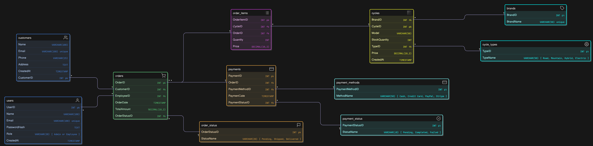
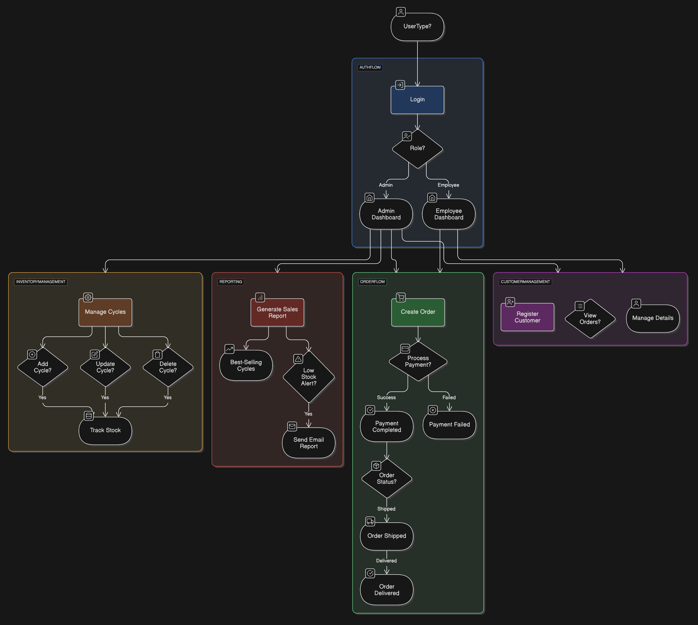
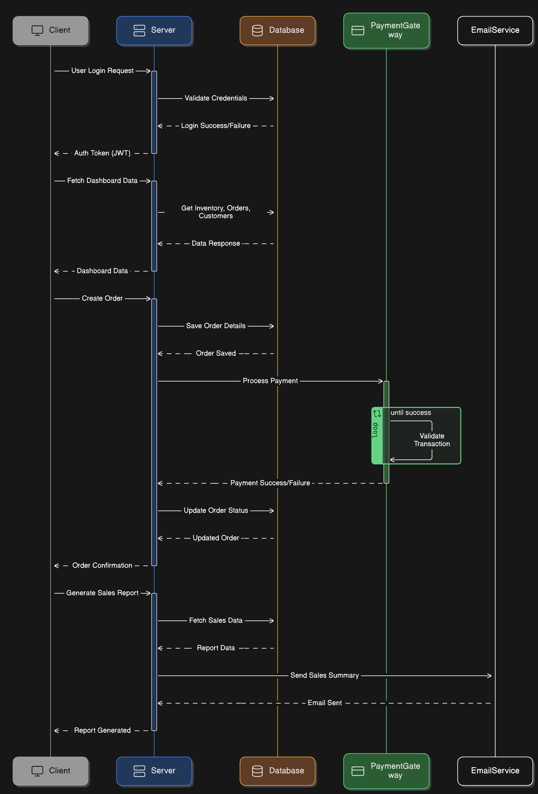

# RetailShop E-Commerce API

## Overview

A modern, feature-rich e-commerce backend built with .NET Core 8.0, implementing clean architecture principles. This API provides comprehensive endpoints for product management, order processing, payment handling, and customer management, using PostgreSQL for data persistence.

## Table of Contents

- [Features](#features)
- [Architecture](#architecture)
- [Tech Stack](#tech-stack)
- [Getting Started](#getting-started)
- [API Documentation](#api-documentation)
- [Contributing](#contributing)

## Features

### 🛍️ Product Management

- ✅ CRUD operations for products
- ✅ Product categorization and filtering
- ✅ Brand management
- ✅ Price and inventory tracking

### 📦 Order System

- ✅ Order creation and management
- ✅ Order status tracking
- ✅ Multiple payment methods
- ✅ Order history

### 💳 Payment Processing

- ✅ Secure payment handling
- ✅ Multiple payment methods (Credit Card, PayPal, etc.)
- ✅ Payment status tracking
- ✅ Transaction history

### 👥 Customer Management

- ✅ Customer profiles
- ✅ Order history
- ✅ Address management

### 📊 Inventory Management

- ✅ Stock level tracking
- ✅ Low stock alerts
- ✅ Stock updates
- ✅ Stock availability checks

## Architecture

### Project Structure

```
RetailShop/
├── API/                  # Web API Layer
│   ├── Controllers/      # API endpoints
│   ├── DTOs/            # Data transfer objects
│   ├── Helpers/         # Utility classes
│   └── Middleware/      # Custom middleware
├── Core/                # Domain Layer
│   ├── Entities/        # Domain models
│   ├── Interfaces/      # Core abstractions
│   ├── Services/        # Domain services
│   └── Specifications/  # Query specifications
└── Infrastructure/      # Data Layer
    ├── Data/           # Database context
    ├── Repositories/   # Data access
    └── Services/       # External services
```

### Design Patterns & Principles

- 🏛️ Clean Architecture
- 📚 Repository Pattern
- 🔍 Specification Pattern
- ✨ SOLID Principles
- 🔄 DRY (Don't Repeat Yourself)

### Diagrams

#### Entity Relationship


_Database schema showing relationships between core entities_

#### Application Flow


_High-level overview of the application's data flow_

#### Sequence Flow


_Request/response flow for key operations_

## Tech Stack

- ⚡ .NET Core 8.0
- 🗄️ Entity Framework Core 8.0
- 🐘 PostgreSQL
- 🔄 AutoMapper
- 📚 Swagger/OpenAPI

## Getting Started

### Prerequisites

- .NET Core SDK 8.0
- PostgreSQL
- Visual Studio Code or Visual Studio 2022

### Setup Steps

1. **Clone Repository**

```powershell
git clone https://github.com/Floyden-Monteiro/RetailShop.git
cd RetailShop
```

2. **Configure Database**

```json
{
  "ConnectionStrings": {
    "DefaultConnection": "Host=localhost;Database=retailshop;Username=your_username;Password=your_password"
  }
}
```

3. **Run Migrations**

```powershell
dotnet ef database update -p Infrastructure -s API
```

4. **Start Application**

```powershell
cd API
dotnet run
```

## API Documentation

### 🛍️ Products

- `GET /api/products` - List all products
- `GET /api/products/{id}` - Get product details
- `POST /api/products` - Create product
- `PUT /api/products/{id}` - Update product
- `DELETE /api/products/{id}` - Delete product

### 📦 Orders

- `GET /api/orders` - List all orders
- `GET /api/orders/{id}` - Get order details
- `POST /api/orders` - Create order
- `PUT /api/orders/{id}/status` - Update status

### 💳 Payments

- `GET /api/payments` - List all payments
- `GET /api/payments/{id}` - Get payment details
- `POST /api/payments` - Process payment
- `GET /api/payments/order/{orderId}` - Get order payment

### 👥 Customers

- `GET /api/customers` - List all customers
- `GET /api/customers/{id}` - Get customer details
- `POST /api/customers` - Create customer
- `PUT /api/customers/{id}` - Update customer

### 📊 Inventory

- `GET /api/inventory/low-stock` - Check low stock
- `PUT /api/inventory/update-stock/{id}` - Update stock
- `GET /api/inventory/check-stock/{id}` - Check availability

#### Example Requests

**Check Low Stock**

```http
GET /api/inventory/low-stock?threshold=5
```

**Update Stock**

```http
PUT /api/inventory/update-stock/1
Content-Type: application/json

{
    "quantity": 100
}
```

**Check Availability**

```http
GET /api/inventory/check-stock/1?quantity=5
```

## Contributing

1. Fork repository
2. Create feature branch (`git checkout -b feature/NewFeature`)
3. Commit changes (`git commit -m 'Add NewFeature'`)
4. Push to branch (`git push origin feature/NewFeature`)
5. Open Pull Request

